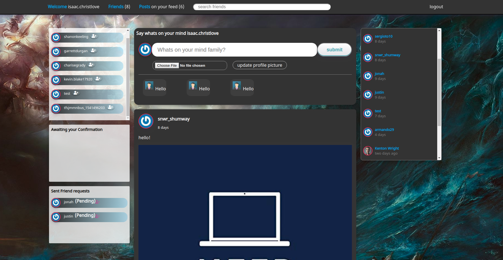
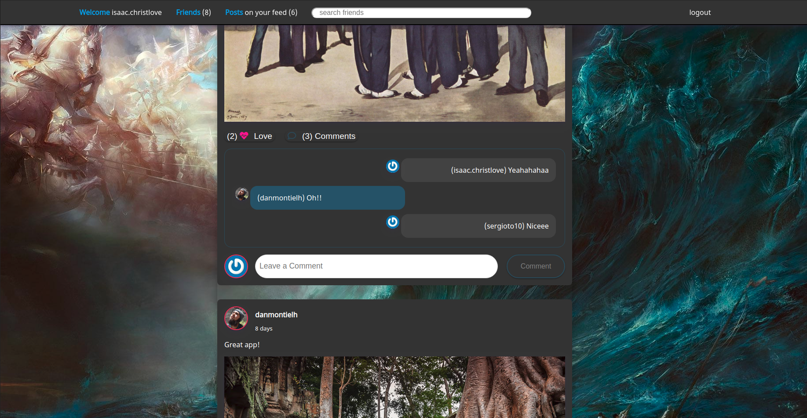
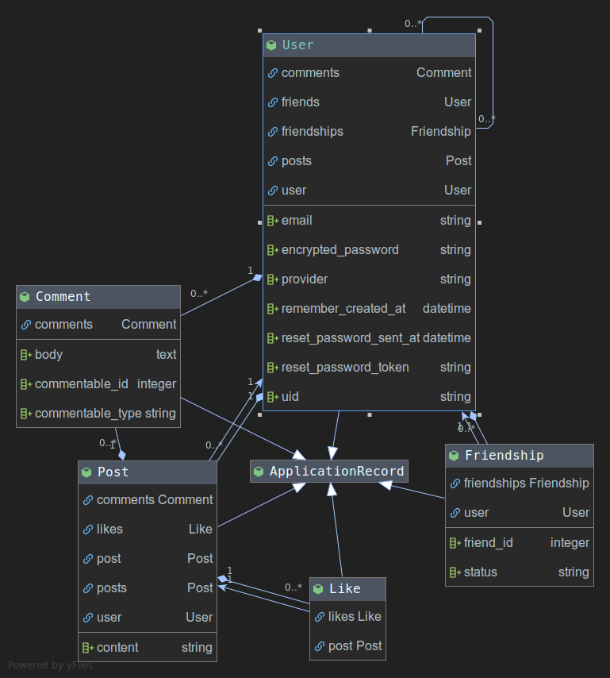

# Facebook Like Project

Live https://trini-social.herokuapp.com/

### Simple auth system build with rails

### Created By 

[Isaac](https://github.com/ispirett)  and [Armando](https://github.com/SotoArmando)


### Requirements rails 6 and ruby 2.6.3
### Run Project
* Clone Repo
* Run these commands 
*  ``` bundle install ```
* ``` rake db:migrate ```
* ``` rails server```

### Images







## Features 


- Publish Comments and Likes

- Publish Post

- Add Friends

- Accept Friends

- Single page app

- E-Mail auth

- Facebook auth 
